# BCDL — a vision framework for the RDK BPU

[](LICENSE)
[](CMakeLists.txt)
[](pyproject.toml)
[-0A7BBB.svg)](#requirements)
[](CHANGELOG.md)

**English** | [简体中文](README.md)

> ### Build a BPU vision application in minutes.
> One set of C++ and Python APIs across capture → hardware codec → preprocessing →
> BPU inference → post-processing.
> **Built on top of the official runtime — not a replacement for it.**

```python
import bcdl, cv2

engine = bcdl.Engine("models/yolo26s_det_nashm_640x640_nv12.hbm")
pipe   = bcdl.AsyncDetectionPipeline(engine)       # input size and head read from the model

pipe.submit(cv2.imread("data/images/bus.jpg"))     # HxWx3 uint8 BGR
pipe.finish()
for d in pipe.next():
    print(d.class_id, d.score, d.x1, d.y1, d.x2, d.y2)
```

```bash
conda install -c https://mirrors.ruis.ai/conda -c conda-forge bcdl
```

Install on the board and run — no compiler, no line of `hbDNN` / `hbUCP`, no NMS
of your own.

**Jump to:**
[Why BCDL](#why-bcdl) ·
[Relation to the official SDK](#relation-to-the-official-sdk) ·
[Architecture](#architecture) ·
[Quickstart](#quickstart) ·
[Examples](#examples) ·
[Capabilities](#capabilities) ·
[Models](#models) ·
[Benchmarks](#benchmarks) ·
[Documentation](#documentation) ·
[Build from source](#build-from-source) ·
[Tests](#tests) ·
[Community](#community)

## Gallery

Annotated outputs from the on-board benchmark suite (real models on RDK S100P).
Reproduce with `scripts/board_bench.py`; full numbers in
[`benchmarks/RESULTS.md`](benchmarks/RESULTS.md).

| Classification (top-k) | Detection (YOLO26 LTRB) | Detection — DFL head (YOLOv8) |
|:---:|:---:|:---:|
| 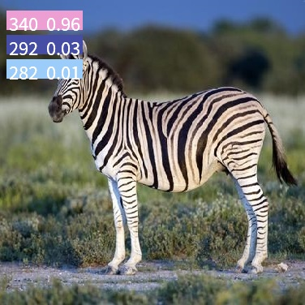 | 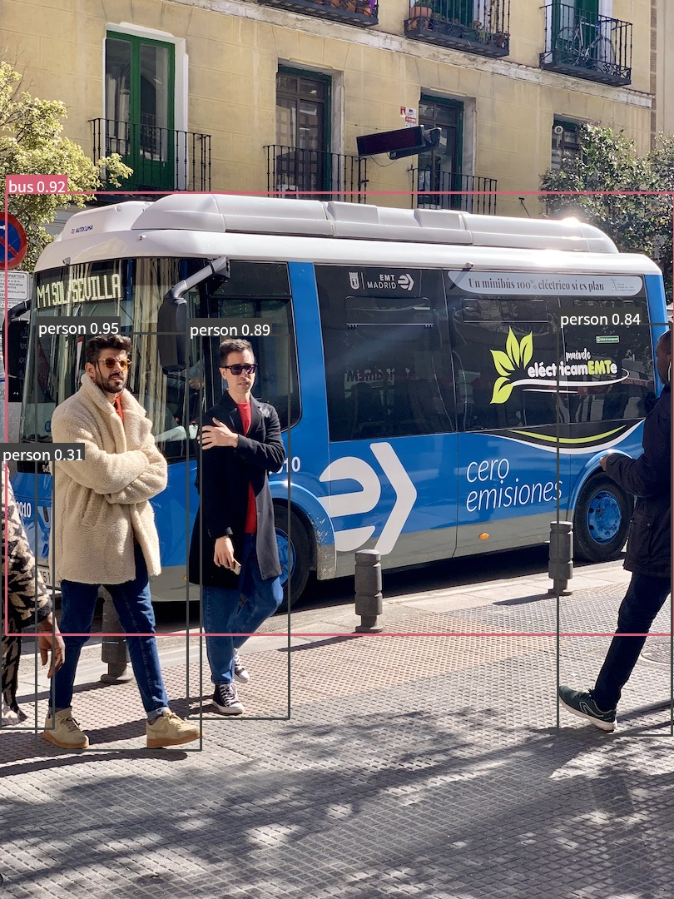 |  |
| **Oriented boxes (OBB)** | **Multi-object tracking (ByteTrack)** | **Pose (17-keypoint)** |
| 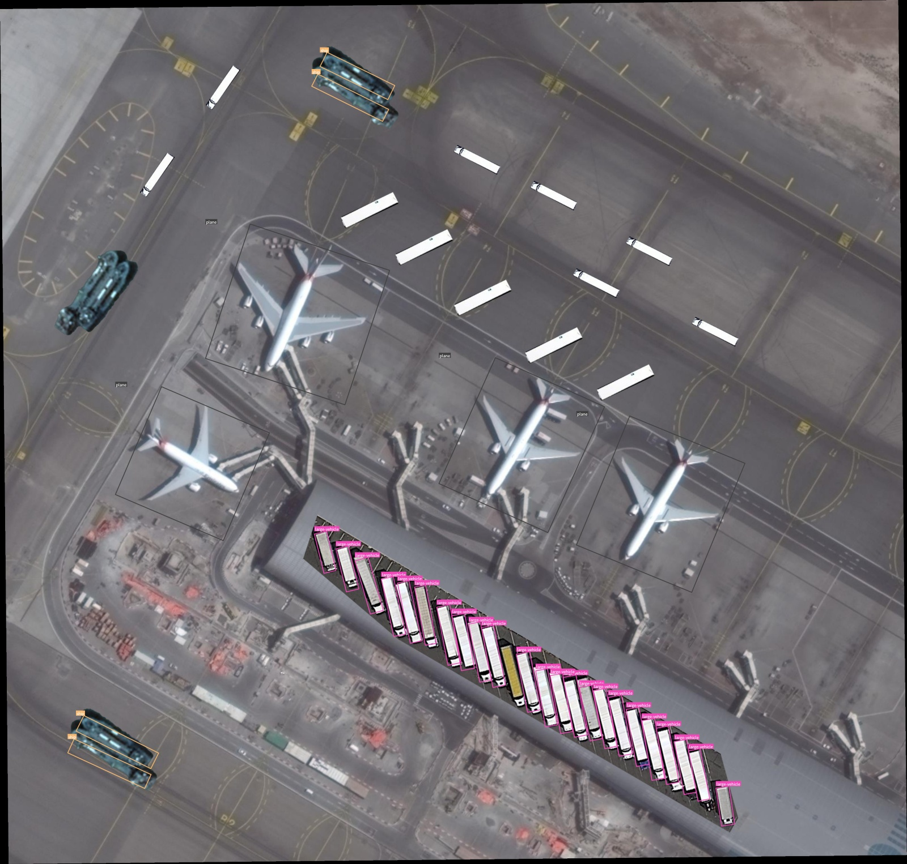 | 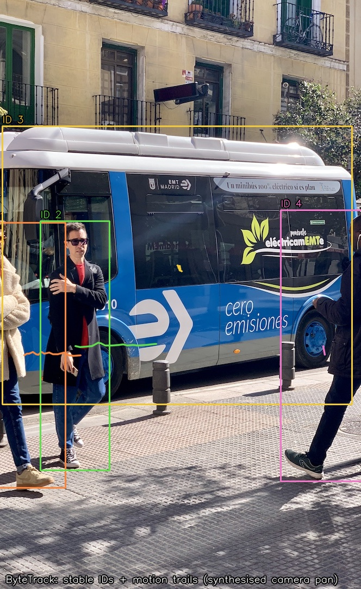 | 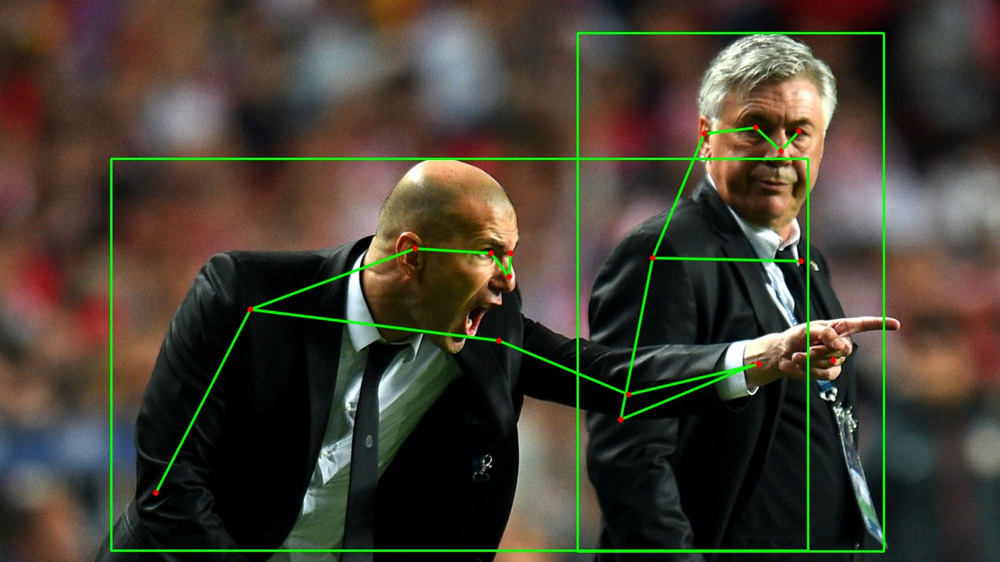 |
| **Instance segmentation** | **Semantic segmentation** | **Monocular depth** |
| 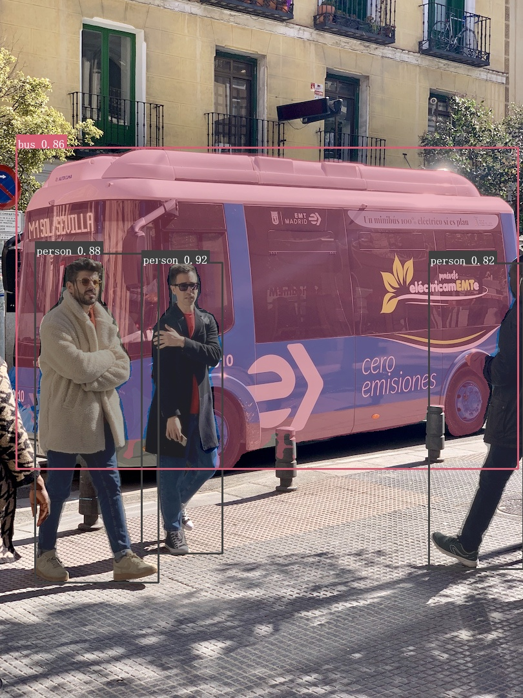 | 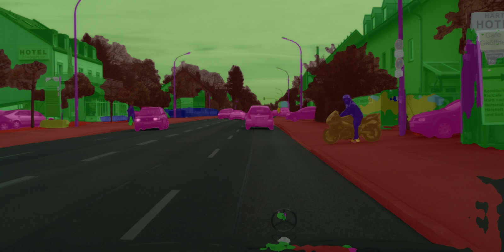 | 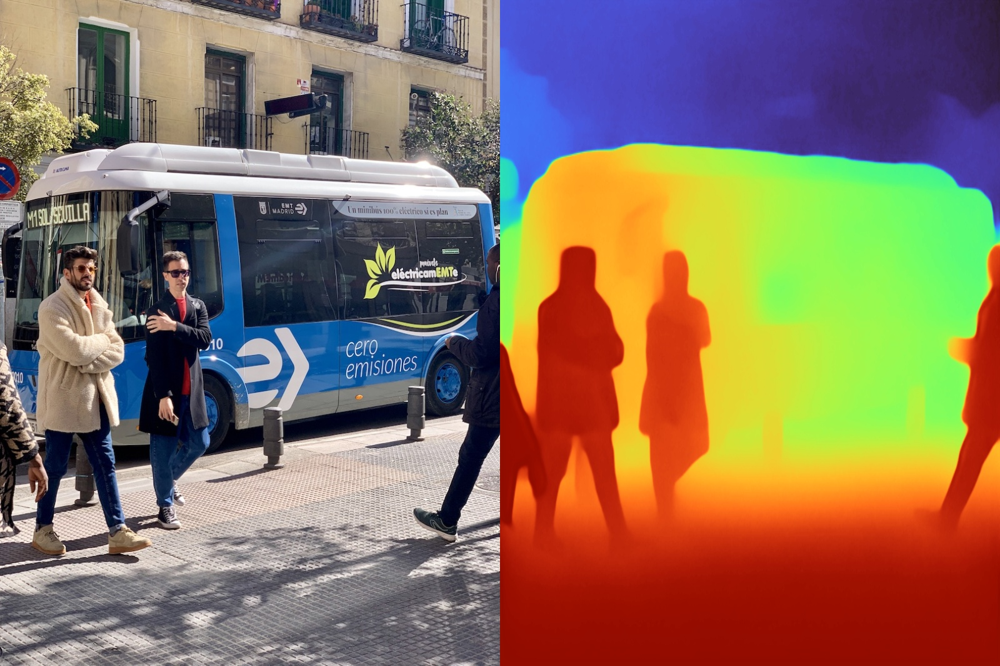 |
| **Stereo depth (LAS2)** | **OCR (3-stage PP-OCR)** | **Hardware JPEG decode (JPU)** |
| 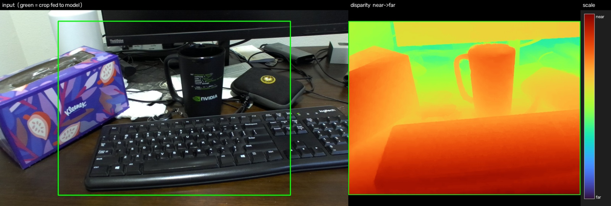 | 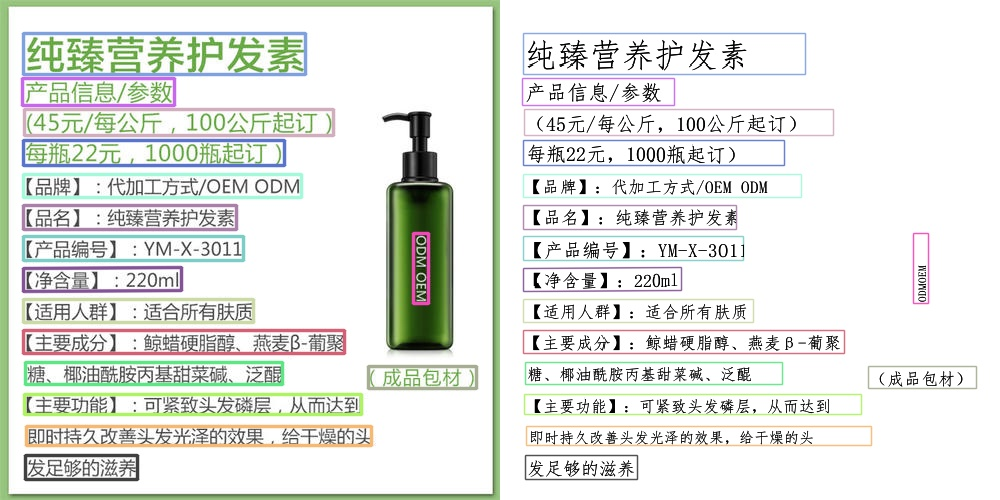 | 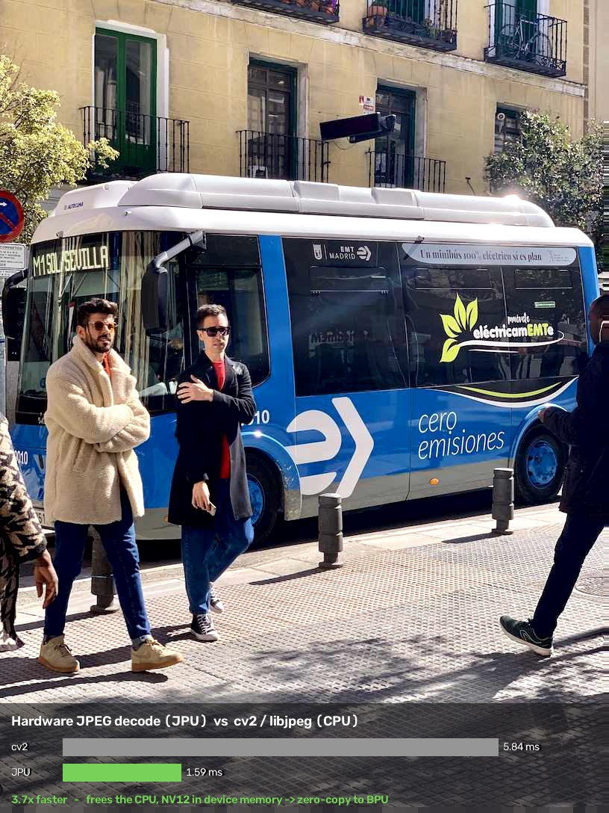 |
| **Whole-body pose (133 keypoints)** | **Sparse features & matching (XFeat)** | **Super-resolution x4 (SPAN)** |
| 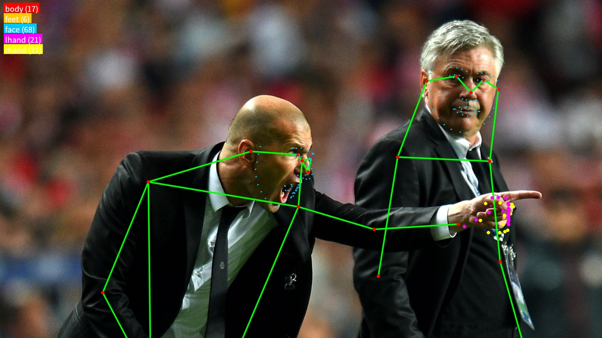 | 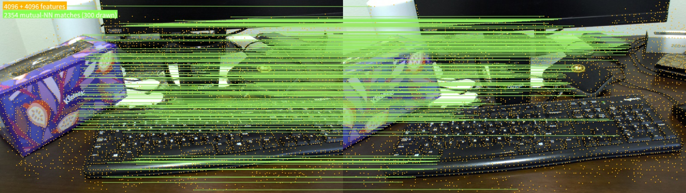 | 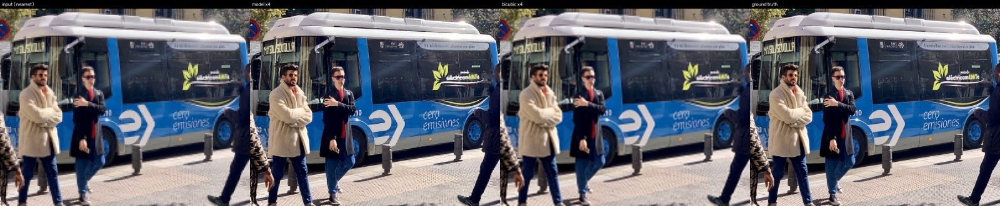 |

## Why BCDL

Between "I have a board and an `.hbm`" and "boxes on screen" sit: allocating
device memory, flushing caches at the right moments, releasing task handles,
dequantising output tensors, writing NMS / DFL / CTC, and getting the decoder's
NV12 into the model without a BGR round-trip. BCDL does all of that once, and
does it correctly.

- **✅ One-line install** — prebuilt linux-aarch64 conda packages (Python
  3.9–3.14). No toolchain on the board; `import bcdl` right after install.
- **✅ Unified API** — 18 vision tasks share one `Engine` + task-class model.
  Switching task doesn't switch mental model, and C++ and Python are peers.
- **✅ No hand-written memory or cache discipline** — `SysMem` lifetime, clean
  before infer and invalidate before read are the `Engine`'s job. **This is the
  most common correctness bug on the BPU**, and it presents as results that look
  almost right and simply aren't.
- **✅ Post-processing included** — per-class NMS, DFL, rotated IoU, CTC,
  proto × mask-coef… all portable CPU/NEON implementations (rewritten from CUDA
  kernels) and pinned by deterministic tests.
- **✅ Zero-copy pipelines by default** — JPU decode → GDC hardware letterbox →
  BPU infer → VPU encode, with no BGR hop and no `memcpy` in between. Compressed
  video end to end at 1080p: **441 FPS**.
- **✅ The traps are already handled** — YOLOP's anchor decode does not survive
  BPU compilation, the face detector pads bottom-right, embedding towers want a
  squashing resize rather than a letterbox… all dealt with in the library
  (see [Capabilities](#capabilities)) instead of costing you a week.
- **✅ Verifiable and reproducible** — 97 tests (66 of which need no board), and
  an on-board benchmark that reruns itself until the board is provably quiet.

## Relation to the official SDK

BCDL **does not replace the official SDK, it is built on it**: every bit of
compute still comes from the D-Robotics hobot runtime (`hbDNN` / `hbUCP` /
media codec). The difference is the **level of abstraction**:

| | Official SDK (hbDNN / hbUCP / media codec) | BCDL |
|---|---|---|
| Shape | low-level runtime + sample programs | a reusable framework (library) |
| Interface | mostly C APIs | C++17 RAII classes + Python bindings |
| Device memory | malloc/free `hbUCPSysMem` yourself, clean/invalidate yourself | handled by `Engine` |
| Post-processing | write your own (NMS / DFL / rotated IoU / CTC…) | 18 tasks out of the box |
| Media plumbing | per-unit APIs, move buffers yourself | one `SysMem`, zero-copy pipelines |
| Languages | C / C++ | C++ and Python as peers, NumPy in/out |
| Getting started | copy a sample, adapt per model | `conda install` + ten lines |
| Organisation | a sample per model | one interface per task |

In one line: **the official SDK makes the BPU run; BCDL turns it into an
application in minutes.**

## Architecture

```
                  your application (C++ / Python)
                              ↓
   ┌──────────────────────────────────────────────────────┐
   │  BCDL                                                 │
   │  tasks · tracks · pipeline · media · preproc · backend │
   └──────────────────────────────────────────────────────┘
                              ↓
       D-Robotics hobot SDK (the official runtime, where the capability comes from)
       hbDNN · hbUCP · media codec · VPS/GDC · hb_vp
                              ↓
              BPU "Nash" · JPU · VPU · GDC
```

The whole S-series compute + media stack is unified on two hobot primitives —
which is why zero-copy is the default rather than an optimization:

- **`hbUCPSysMem`** — one shared-memory buffer (`phyAddr` + `virAddr`) used alike
  by BPU tensors, JPU/VPU codec images, and the VP preprocessing units.
- **`hbUCPTaskHandle_t`** — one task/queue model; BPU inference, JPEG/H.264/H.265
  codec, and resize/cvtColor all submit & wait through the same `hbUCP` scheduler.

So **zero-copy across JPU → VP/GDC → BPU → VPU is the default, not an
optimization.** BCDL is a thin, RAII-clean C++ layer over that fabric plus
portable post-processing.

Repository layers:

```
python/    nanobind bindings (NumPy <-> tensors), GIL-released infer
tasks/     det · cls · pose · seg · obb · semseg · depth · mono3d · ocr · open-vocab · sam · embed
           drive · face · wholebody · features · superres · depth-refine
tracks/    ByteTrack multi-object tracker · ReID appearance embeddings
pipeline/  sync / async detection · tracking · stereo  (JPU -> VP -> BPU -> CPU/VPU)
media/     JpegCodec (JPU) · VideoCodec H.264/H.265 (VPU)
backend/   Engine, output readers          (libdnn  -> hbDNN*)
preproc/   CPU letterbox + BGR->NV12 (OpenCV/OpenMP); GDC HW letterbox + dense remap (VPS); VP (hb_vp)
core/      SysMem · Task · Status · MemPool (libhbucp -> hbUCP*)
```

## Quickstart

### 1. Install (one minute)

Prebuilt **linux-aarch64** packages (Python 3.9–3.14) are published to a conda
channel, so on the board you can skip the source build entirely:

```bash
conda install -c https://mirrors.ruis.ai/conda -c conda-forge bcdl
python -c "import bcdl; print(bcdl.__version__)"
```

Prefer a clean, reproducible environment? Create one and pin a version:

```bash
conda create -n bcdl -c https://mirrors.ruis.ai/conda -c conda-forge \
    python=3.12 bcdl
conda activate bcdl
# or pin an exact build:   conda install ... "bcdl=0.5.0"
```

To avoid passing `-c` every time, add the channel to the env (it must sit
**above** conda-forge so the `hobot-*` packages resolve from here):

```bash
conda config --env --add channels https://mirrors.ruis.ai/conda
conda config --env --add channels conda-forge
```

Then `conda install bcdl` / `conda update bcdl` resolve against the channel
directly. Verify the install end-to-end (prints the version and the loaded
native extension path):

```bash
python -c "import bcdl, bcdl_py; print('bcdl', bcdl.__version__); print(bcdl_py.__file__)"
```

That resolves the whole stack as four packages — the Python bindings, the C++
library, and the packaged D-Robotics hobot SDK they link against:

| package | ships |
|---------|-------|
| **bcdl** | the `bcdl` / `bcdl_py` Python bindings (one build per Python 3.9–3.14) |
| **libbcdl** | the C++ library — `libbcdl.so`, public headers, and the `find_package(bcdl)` CMake config |
| **hobot-dnn** | the BPU/DNN runtime SDK (`libdnn`, `libhbucp`, `libhbvp`, …) + `hobot/` headers |
| **hobot-media** | the media/codec line (`libffmedia`, `libgdcbin`, `libmultimedia`, …) + media dev headers |

For a **C++-only** consumer, install just the library and build against it with
`find_package(bcdl)` (it pulls `libbcdl` + `hobot-dnn` + `hobot-media`):

```bash
conda install -c https://mirrors.ruis.ai/conda -c conda-forge libbcdl
```

> The packaged hobot SDK still relies on the board's **device platform libraries**
> (`libbpu`, `libhbmem`, `libalog`, `libvdsp`, `libhbipcfhal`) under
> `/usr/hobot/lib` — they ship with the RDK system image and resolve via
> `ldconfig`, and are intentionally not redistributed.

### 2. Get a model (one minute)

BCDL is a generic runtime and loads any `.hbm`. The three fastest routes:

- what the board image already ships (`/opt/hobot/model/s100/basic` — e.g. YOLOv8
  detection, DeepLabV3+);
- the prebuilt models in D-Robotics **`rdk_model_zoo`**;
- convert your own: the full recipes (export, calibration, `hb_compile` config,
  measured accuracy/latency) live in the companion
  [**bcdl-model-zoo**](https://github.com/ruisv/bcdl-model-zoo) repository.

Drop the `.hbm` under [`models/`](models/) — the examples and tests reference
models only by the repo-relative path `models/<name>.hbm`. What each model is,
where it came from, which build to take and under what licence:
[`docs/MODELS.md`](docs/MODELS.md).

### 3. Run (one minute)

The Python snippet at the top is the whole program. On the C++ side,
[`examples/`](examples/) holds standalone programs:

```bash
./build/det_demo    models/yolo26s_det_nashm_640x640_nv12.hbm data/images/bus.jpg
./build/ocr_demo    data/images/ocr.jpg          # PP-OCR det -> cls -> rec
./build/track_demo  models/yolo26s_det_nashm_640x640_nv12.hbm  # detect + ByteTrack
./build/video_det_demo  stream.h264 model.hbm    # VPU decode -> BPU detect
```

## Examples

Everything under [`examples/`](examples/) is a standalone runnable program:

**Vision tasks**

| example | what it does |
|---|---|
| [`det_demo.cc`](examples/det_demo.cc) | object detection, boxes drawn to an image |
| [`ocr_demo.cc`](examples/ocr_demo.cc) | 3-stage OCR: detect → angle classify → recognize |
| [`depth_demo.cc`](examples/depth_demo.cc) | monocular depth |
| [`stereo_demo.cc`](examples/stereo_demo.cc) | stereo disparity / depth |
| [`depth_refine_demo.cc`](examples/depth_refine_demo.cc) | RGB-D depth refinement: hole-filling + point cloud |
| [`embed_demo.cc`](examples/embed_demo.cc) | image embeddings (retrieval / zero-shot classification) |
| [`track_demo.cc`](examples/track_demo.cc) | detection + ByteTrack multi-object tracking |

**Video and streaming**

| example | what it does |
|---|---|
| [`video_det_demo.py`](examples/video_det_demo.py) | video file end to end: VPU decode → BPU detect → draw → VPU encode → mp4 |
| [`video_det_demo_async.cc`](examples/video_det_demo_async.cc) | the same path, async, in C++ |
| [`rtsp_det_demo.py`](examples/rtsp_det_demo.py) | **live RTSP detection**, pure hardware decode (~233 FPS at 1080p H.264) |
| [`video_decode.cc`](examples/video_decode.cc) · [`video_roundtrip.cc`](examples/video_roundtrip.cc) | H.264/H.265 decode / codec round-trip |
| [`jpeg_roundtrip.cc`](examples/jpeg_roundtrip.cc) | hardware JPEG encode/decode (JPU) |

**Performance and probes**

| example | what it does |
|---|---|
| [`pipeline_bench.cc`](examples/pipeline_bench.cc) · [`async_bench.cc`](examples/async_bench.cc) | sync / async pipeline throughput |
| [`gdc_letterbox_bench.cc`](examples/gdc_letterbox_bench.cc) | GDC hardware letterbox vs CPU |
| [`mempool_demo.cc`](examples/mempool_demo.cc) · [`vp_probe.cc`](examples/vp_probe.cc) | device memory pool / VP unit probes |

The minimal Python usage for every task is in [`docs/API.md`](docs/API.md).

## Capabilities

Every task is available at **two levels**: a high-level task class (give it an
`Engine` + config, get results in one call), or a pure `decode_*` function that
takes float32 NumPy arrays — **no Engine, no board, no model needed**.

- **Backend** — `Engine` over `hbDNN` (`hbDNNInferV2`); automatic cache discipline
  (clean before infer, invalidate before read); zero-copy / dequantising output
  readers.
- **Tasks** (CPU/NEON post-process):
  - **Detection** — anchor-free LTRB multi-scale + DFL heads (YOLO26 / YOLOv8 /
    v5 / v11), per-class NMS.
  - **Classification, Pose** (17-keypoint), **Instance segmentation** (proto ×
    mask-coef), **Oriented boxes** (OBB, rotated-IoU NMS), **Semantic
    segmentation**, **Monocular depth**, **Stereo depth** (two-image disparity),
    **Monocular 3D detection** (SMOKE — 3D box + orientation from a single image).
  - **RGB-D depth refinement** — **LingBot-Depth**: feed an existing noisy, holey
    sensor depth map (stereo or ToF) together with the aligned RGB frame, get
    back hole-filled metric depth plus a per-pixel trust mask, ready to unproject
    into a point cloud. It refines rather than estimates, so it complements the
    two depth heads above.
  - **OCR** — full 3-stage pipeline: DBNet detect → PP-LCNet direction classifier
    (0°/180°) → CRNN/CTC recognize. **Defaults to PP-OCRv6** with an all-int16
    recogniser build (on the S100P it roughly halves the character error of the
    compiler's default mixed-precision int8 build *and* is ~2× faster); PP-OCRv5
    is kept as a fallback.
  - **Open-vocabulary detection / segmentation** — **YOLOE** (prompt-free, ships a
    COCO-80 label table `LabelMap`, reuses the LTRB / DFL decode — name classes
    without retraining).
  - **Promptable segmentation** — **EdgeSAM** interactive segmentation (point / box
    prompts; RepViT image encoder → cached embedding → prompt decoder two-stage,
    `SamSession`).
  - **Panoptic driving perception** — YOLOP emits three heads from one
    inference: vehicle detection (anchor-based `AnchorDetector`) plus drivable
    area and lane lines (both through `Segmenter`). Note that the published ONNX
    bakes the anchor decode into the graph via ScatterND, and **that decode does
    not survive BPU compilation** — the objectness/class columns are never
    written, giving zero detections at any threshold — so the graph is cut before
    it and `decodeYoloV5Anchor` runs the arithmetic on the CPU.
  - **Image embeddings** — `ImageEmbedder` + `EmbeddingBank` (retrieval and
    zero-shot classification: pooled read-out + L2 normalize + cosine top-k).
    Note that an embedding `.hbm` commonly packs several submodels (a pooled
    whole-image vector and a per-patch feature grid) — pick the pooled one with
    `Engine::modelNames`; preprocessing is a **squashing resize, not a
    letterbox** (these towers never saw padding bars).
  - **Face** — SCRFD detection (5 keypoints, 0.35 px against the float keypoints)
    plus closed-form Umeyama alignment `alignFace` to the 112×112 template;
    recognition needs no new task — run the aligned crop through `ImageEmbedder`
    and compare with `EmbeddingBank`. Note this detector **places the image
    top-left and pads bottom-right** (`face_letterbox` returns zero padding); a
    centred letterbox shifts every box and keypoint.
  - **Whole-body pose (133 keypoints)** — ViTPose, **top-down**: unlike the pose
    head above it runs once per **person** crop, so it needs a detector in front
    and its cost grows with the crowd; in exchange you get feet, a 68-point face
    and both hands. 1.68 ms/person.
  - **Sparse features & matching** — XFeat: repeatable keypoints + L2-normalized
    64-D descriptors, with mutual-nearest-neighbour matching (`matchFeatures`).
    Only the convolutional trunk is on the BPU (~1.0 ms, 3.1 MB); the input
    InstanceNorm and the softmax / NMS / top-k / sparse sampling stay on the CPU,
    so the graph carries no dynamic control flow.
  - **Super-resolution** — tiled ×4 upscaling (`SuperResolver`, overlapped
    cross-faded stitching). **Two models, two strengths**: SPAN is
    fidelity-oriented — more accurate on clean input and 6× smaller; Compact is
    perceptual, trained on real degradations, and stronger on blurry/compressed
    input. Choose by input domain; neither supersedes the other.
  - **Multi-object tracking** — ByteTrack (Kalman + two-stage association); ReID
    appearance embeddings with L2-normalize + cosine similarity (BoT-SORT
    association primitives), BoostTrack++ and camera-motion compensation.
  - Detection heads take both **PTQ (NV12 two-plane) and QAT-exported float-input**
    models (`detect_float` / `letterbox_chw_float`).
- **Hardware preprocessing** — fixed geometric transforms on the VPS GDC engine:
  hardware letterbox and arbitrary dense remap `GdcRemap` (cv2.remap semantics, for
  stereo rectification; 2448×2048 ≈ 6.3 ms, CPU mostly idle).
- **Media** — hardware **JPEG** (JPU) and **H.264 / H.265** (VPU) encode/decode,
  plus a path that feeds an RTSP network stream straight into the hardware decoder.
- **Pipelines** — synchronous buffer-reuse `DetectionPipeline`, threaded
  `AsyncDetectionPipeline` (preproc ‖ infer overlap), `TrackingPipeline`,
  `StereoPipeline`, and a video-file / RTSP → decode → detect path.
- **Python** — nanobind bindings: NumPy in/out, every decoder + pipeline, GIL
  released around blocking infer.

## Models

Compiled BPU models (`.hbm`) are **not** committed (they are large) — place them
under [`models/`](models/), populated by
[`scripts/fetch_models.sh`](scripts/fetch_models.sh). Model conversion
(ONNX → `.hbm`, PTQ calibration) is done **offline** with the D-Robotics
**OpenExplorer** toolchain on an x86 host; the full conversion recipes — export,
calibration, `hb_compile` config and each model's measured accuracy/latency —
live in the companion [**bcdl-model-zoo**](https://github.com/ruisv/bcdl-model-zoo)
repository. Each `.hbm` is compiled for a specific BPU **march**, so use one built
for your board (the S100 / S100P share the Nash march; S600 is compiled for its
own) — the BCDL runtime itself is the same across the S-series.

**What each model is, where it came from, which build to take, and its licence:
[`docs/MODELS.md`](docs/MODELS.md).** The example/benchmark models come from
third parties, and **the weights and their compiled `.hbm` follow their own
upstream licences** — notably the Ultralytics YOLO weights are **AGPL-3.0**
(copyleft; commercial use needs their Enterprise license) and the insightface
face weights are **academic / non-commercial**. Check each before redistributing
or using commercially. BCDL's own code (this repo, Apache-2.0) is independent of
these — it's a generic runtime that can load any `.hbm`; those licences apply to
the model weights, not to BCDL.

## Benchmarks

Measured on **RDK S100P** (sw 4.0.5). `infer` is BPU inference only; `decode`
adds BCDL's post-processing; `model` is the `.hbm` size on disk. Annotated
outputs for each row are in the [Gallery](#gallery).

| task | model | input | infer ms | infer FPS | decode ms | model MB |
|------|-------|-------|----------|-----------|-----------|----------|
| cls    | yolo26n              | 224²        | 0.44  | 2251 | 0.49  | 3.9  |
| det    | yolo26n (LTRB)       | 640²        | 1.16  | 860  | 2.02  | 7.8  |
| det_dfl| yolov8 (DFL head)    | 640²        | 1.45  | 689  | 9.49  | 3.7  |
| pose   | yolo26n              | 640²        | 1.29  | 778  | 1.46  | 7.7  |
| seg    | yolo26n              | 640²        | 1.63  | 615  | 10.7  | 9.9  |
| obb    | yolo26n              | 640²        | 1.11  | 900  | 1.65  | 5.8  |
| semseg | deeplabv3plus        | 2048×1024   | 49.0  | 20   | 57.2  | 39.1 |
| semseg_rt| PIDNet-S (1/8 output)| 2048×1024  | 4.52  | 221  | 4.70  | 19.0 |
| depth  | depth-anything-v2    | 686×518     | 111   | 9    | 115   | 121.8|
| stereo | las2-m (crop)        | 640×480     | 14.0  | 72   | 21.6  | 40.7 |
| ocr    | PP-OCRv5 server (det→cls→rec)| 960² / 48×320 | 20.0 | 50  | 135   | 35.3 |
| embed  | SigLIP base/16       | 224²        | 19.3  | 52   | 20.2  | 129  |
| drive  | YOLOP (det+drivable+lane)| 640²   | 2.80  | 358  | 5.44  | 12.0 |
| face⁰  | SCRFD-10G            | 640²        | 60.2  | 17   | 61.5  | 5.9  |
| wholebody| ViTPose-S (133 kpt) | 192×256     | 1.69  | 593  | 17.3¹ | 29.1 |
| features| XFeat              | 640×480     | 1.00  | 998  | 201²  | 3.2  |
| superres| Compact ×4         | 128²        | 2.04  | 491  | 27.6³ | 38.9 |
| superres| SPAN ch48 ×4       | 128²        | 1.14  | 874  | 22.5³ | 6.1  |

⁰ Face is not in the `board_bench.py` suite (it needs a face image), so this row was
  measured separately; every other row comes from one clean run. SCRFD-10G is the
  heavy tier — drop to 2.5g for speed. Recognition runs through `ImageEmbedder`
  (cosine 0.975 against float).
¹ Top-down: `infer` is **per person**, `decode` is the whole frame (2 people in that
  image) — the cost grows with the crowd.
² Includes extraction on both images **and** the matching; matching is
  O(|a|·|b|·64), and at the default 4096 points per side it is ~130 ms of that —
  `top_k` at 1024 costs 8 ms.
³ Tiled upscaling: `infer` is **one tile**, `decode` is the whole image
  (202×270 → 808×1080, 6 tiles).

Streaming throughput on yolo26s @1280×720: synchronous **216 FPS**, async
overlap **334 FPS** (1.55×). Hardware **JPEG** decode (JPU) is **≈3.6–5.3×**
faster than `cv2`/libjpeg on the sample images and offloads the CPU (zero-copy
NV12→BPU).

Compressed video, end to end (`AsyncVideoDetectionPipeline`, yolo26n @1080p):
**441 FPS** on H.264 and **439–451 FPS** on H.265, bounded by the VPU decode. The
decoded NV12 is letterboxed straight into the model input on the GDC hardware
engine — no BGR round-trip (0.97 ms/frame, only ~0.3 ms of it CPU). Pure VPU
decode runs at 452 / 481 FPS. The input must be an **Annex-B elementary stream**;
demux an MP4 first with `ffmpeg -c:v copy -bsf:v h264_mp4toannexb` (container
only, pixels untouched).

Reproduce on the board:

```bash
PYTHONPATH=build:python python scripts/board_bench.py --retry-until-clean 3
```

> `--retry-until-clean` checks the `det` / `depth` rows against the committed
> `results.json` and, if they drift too far, calls the board **busy with someone
> else's work**, discards the run and retries. This is not belt-and-braces — the
> same model has been measured **30× apart**. Every other signal lies: load average
> sits near the core count because of resident D-state kernel threads; a process
> check lands between two batches of someone else's job; even `hrt_model_exec` is
> dragged down the same way (22 ms on a dirty board vs 0.95 ms on a clean one).
> **The results themselves are the only reliable signal.**

## Documentation

| Document | What it covers |
|----------|----------------|
| [`docs/API.md`](docs/API.md) | **Python API reference** — every class, config, and `decode_*` function, with a usage snippet per task. ([简体中文](docs/API.zh.md)) |
| [`docs/CPP_API.md`](docs/CPP_API.md) | **C++ API reference** — the same surface in `namespace bcdl`, keyed to the headers. ([简体中文](docs/CPP_API.zh.md)) |
| [`docs/MODELS.md`](docs/MODELS.md) | **Model catalogue** — every `.hbm` the examples and benchmarks use: origin, which build to take, and licence. |
| [`docs/GDC.md`](docs/GDC.md) | **GDC hardware geometry** — hardware letterbox and dense remap: usage and limits. |
| [`benchmarks/RESULTS.md`](benchmarks/RESULTS.md) | Full on-board benchmark numbers + the annotated check images in the [Gallery](#gallery). |
| [`CONTRIBUTING.md`](CONTRIBUTING.md) | How to set up, build (on the board), test, and submit changes. |
| [`CHANGELOG.md`](CHANGELOG.md) | Release notes (Keep a Changelog / SemVer). |

Public headers live in [`include/bcdl/`](include/bcdl/); runnable programs in
[`examples/`](examples/).

## Requirements

- An **RDK S100 / S100P / S600** board (Ubuntu 22.04, aarch64) with the D-Robotics
  hobot SDK present (`/usr/include/hobot`, `/usr/hobot/lib`: `libdnn`, `libhbucp`,
  `libhbvp`) — or the `hobot-dnn` / `hobot-media` conda packages above. BCDL's
  source is the same across the S-series; a compiled `.hbm` is **march-specific**,
  so run a model built for your target board (see [Models](#models)).
- CMake ≥ 3.22, GCC 11, Ninja.
- OpenCV 5 (image ops; guarded by `BCDL_HAVE_OPENCV` with hand-written fallbacks).
- For the Python module: a Python env with **nanobind** (and NumPy, OpenCV).

## Build from source

Build on the board in your Python/conda env (needs the hobot SDK — from the
`hobot-dnn` / `hobot-media` conda packages above, or the system image at
`/usr/include/hobot` + `/usr/hobot/lib`):

```bash
cmake -S . -B build -G Ninja -DCMAKE_BUILD_TYPE=Release
cmake --build build -j
```

This builds the `bcdl` library, the C++ examples, and the `bcdl_py` Python module.

**Install & consume from CMake** — `find_package(bcdl)` is supported:

```bash
cmake --install build --prefix /your/prefix
```
```cmake
find_package(bcdl CONFIG REQUIRED)
target_link_libraries(your_target PRIVATE bcdl::bcdl)   # pulls in headers + hobot deps
```

**Install the Python module** — a pip-installable wheel (scikit-build-core);
build it on the board (the C++ build needs the hobot SDK):

```bash
pip install .          # or: pip wheel . -w dist/
python -c "import bcdl; print(bcdl.__version__)"
```

## Tests

With **bcdl installed** (from the conda channel above, or a pip wheel), run the
suite straight against the installed module — no `PYTHONPATH` needed:

```bash
pip install pytest          # plus the repo checked out for the test files
pytest tests/               # full suite; on-board tests skip if a model is absent
```

From a **source build**, point pytest at the in-tree module instead:

```bash
# (1) Engine-free numpy decode tests — no board / no models required:
PYTHONPATH=build:python pytest tests/test_detection.py tests/test_pose.py \
    tests/test_obb.py tests/test_instance_seg.py tests/test_depth_seg.py \
    tests/test_depth_seg_py.py tests/test_classification.py tests/test_ocr.py

# (2) On-board, real-model end-to-end — needs models/ populated; each task skips
#     cleanly if its model/image is absent:
PYTHONPATH=build:python pytest tests/
```

Two layers: the post-processing math is pinned by **deterministic NumPy tests**
through the Engine-free `decode_*` bindings (run anywhere), then the **on-board
suite** validates the full BPU/codec path on real models. On RDK S100P,
end-to-end against the **conda packages** (`bcdl` + `libbcdl` + `hobot-dnn` +
`hobot-media`): **96 passed, 1 skipped** (97 collected; the skip needs an
explicit `--hbm`).

| group | files | tests | needs board? |
|-------|-------|-------|--------------|
| Decode math (det/cls/pose/obb/instance-seg/depth/seg/ocr/stereo) + memory-safety | `test_detection`, `test_classification`, `test_pose`, `test_obb`, `test_instance_seg`, `test_depth_seg`(+`_py`), `test_ocr`, `test_stereo_py`, `test_memory_safety` | 66 | no |
| Tasks on real models (cls·det·det_dfl·pose·seg·obb·semseg·depth·OCR 3-stage) | `test_board_models` | 11 | yes |
| Stereo depth (real LAS2 `.hbm`) | `test_stereo_board_py` | 3 | yes |
| Media codecs (VPImage · JPEG/JPU · H.264/H.265/VPU) | `test_codec_py`, `test_video_decode_py` | 11 | yes |
| Pipelines (ByteTrack, async detection) | `test_tracking_py`, `test_async_detection_py` | 5 | yes |

## Community

Join the **BCDL (BPU) tech chat group** to discuss RDK / BPU deployment and using
this project.


> WeChat group QR codes expire; the image above is refreshed in place at the same
> link. If scanning still fails, open an [Issue](../../issues) — you're also
> welcome to just discuss there.

Want large language models on the same board? The sister project
[**BLLM**](https://github.com/ruisv/bllm) is an on-board LLM / VLM runtime for the
BPU built with the same design taste — the two share the BPU and can be scheduled
against each other.

## Contributing

Contributions are welcome — issues and pull requests alike. See
[`CONTRIBUTING.md`](CONTRIBUTING.md) for the full guide; the essentials:

- **Develop anywhere, build & run on the board.** The hobot SDK exists only on
  RDK hardware, so the C++ library and the on-board test suite must be built and
  exercised on an S100 / S100P / S600 board. The Engine-free NumPy `decode_*` tests run
  on any host (see [Tests](#tests)).
- **Conventions** — headers `.h`, implementations `.cc`; namespace `bcdl`;
  errors via `BCDL_CHECK(...)` → `bcdl::Error`. Match the style and structure of
  the surrounding code.
- **Tests** — add or update tests for any behavior change. Pin post-processing
  math with a deterministic NumPy test through the `decode_*` bindings (runs
  anywhere) and, where a model is involved, an on-board end-to-end test that
  skips cleanly when its model is absent.
- **Commits** — keep them focused; follow the existing
  [Conventional Commits](https://www.conventionalcommits.org/) style in the log.
- **Changelog** — note user-visible changes under `[Unreleased]` in
  [`CHANGELOG.md`](CHANGELOG.md).

## Acknowledgments

- **D-Robotics** — the RDK S100 / S100P / S600 platform and the hobot SDK (`hbDNN`,
  `hbUCP`, `hb_vp`, media/codec) that BCDL is built on, and the `rdk_model_zoo`
  reference models.
- **[nanobind](https://github.com/wjakob/nanobind)** — the Python binding layer.
- **[OpenCV](https://opencv.org/)** — image ops on the preprocessing path.
- The upstream model authors whose post-processing BCDL re-implements —
  **PaddleOCR / PaddlePaddle** (PP-OCRv6 / v5, PP-LCNet), **Ultralytics** (YOLO
  family), **Depth-Anything-V2**, and **DeepLabV3+**. See [Models](#models) for
  their licenses; BCDL bundles none of these weights.

## License

BCDL is licensed under the **Apache License 2.0** — see [`LICENSE`](LICENSE).

This covers BCDL's own source code only. The third-party model weights under
`models/` and the `.hbm` compiled from them are governed by their own upstream
licenses (see [Models](#models)) — most notably the Ultralytics YOLO weights are
AGPL-3.0, so follow their upstream terms before using or redistributing.
