# BCDL — BPU Computational Deep Learning

[](LICENSE)
[](CMakeLists.txt)
[](pyproject.toml)
[-0A7BBB.svg)](#运行环境要求)
[](CHANGELOG.md)

[English](README.en.md) | **简体中文**

一个面向 **D-Robotics RDK S100 / S100P / S600**（BPU "Nash" 加速器）的 C++17
推理与多媒体库，并提供对 NumPy 友好的 Python 绑定。BCDL 是 CUDA/TensorRT 视觉栈
的 BPU 原生对应实现：加载一个已编译的 `.hbm` 模型，完成推理、前/后处理、硬件
编解码与取流——全部在板端运行，且默认在多媒体与计算单元之间零拷贝。

## 目录

- [效果展示](#效果展示)
- [为什么选 BCDL](#为什么选-bcdl) · [特性](#特性) · [架构](#架构)
- [安装](#安装) · [快速上手](#快速上手) · [从源码构建](#从源码构建)
- [文档](#文档)
- [性能基准](#性能基准) · [测试](#测试)
- [社区交流](#社区交流) · [参与贡献](#参与贡献) · [致谢](#致谢) · [许可证](#许可证)

## 效果展示

板端基准套件输出的标注结果（在 RDK S100P 上跑真实模型）。
可用 `scripts/board_bench.py` 复现；完整数据见
[`benchmarks/RESULTS.md`](benchmarks/RESULTS.md)。

| 分类（top-k） | 检测（YOLO26 LTRB） | 检测 — DFL 头（YOLOv8） |
|:---:|:---:|:---:|
| 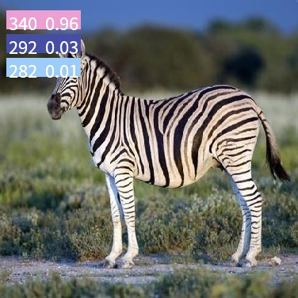 | 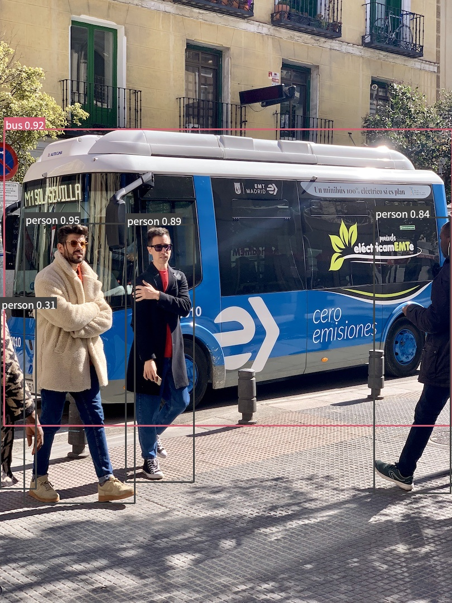 |  |
| **旋转框（OBB）** | **多目标跟踪（ByteTrack）** | **姿态（17 关键点）** |
| 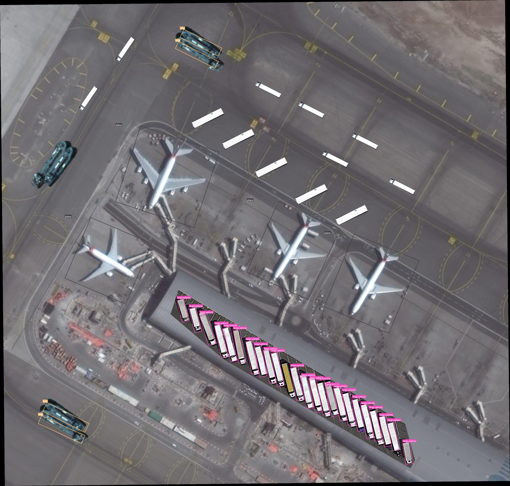 | 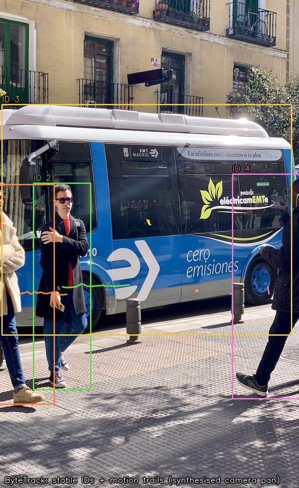 | 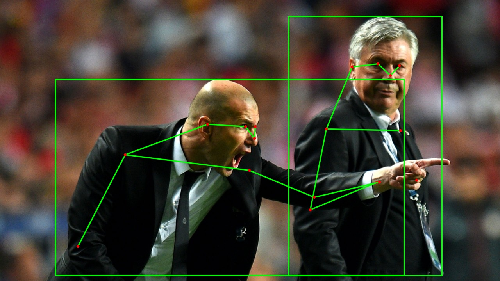 |
| **实例分割** | **语义分割** | **单目深度** |
| 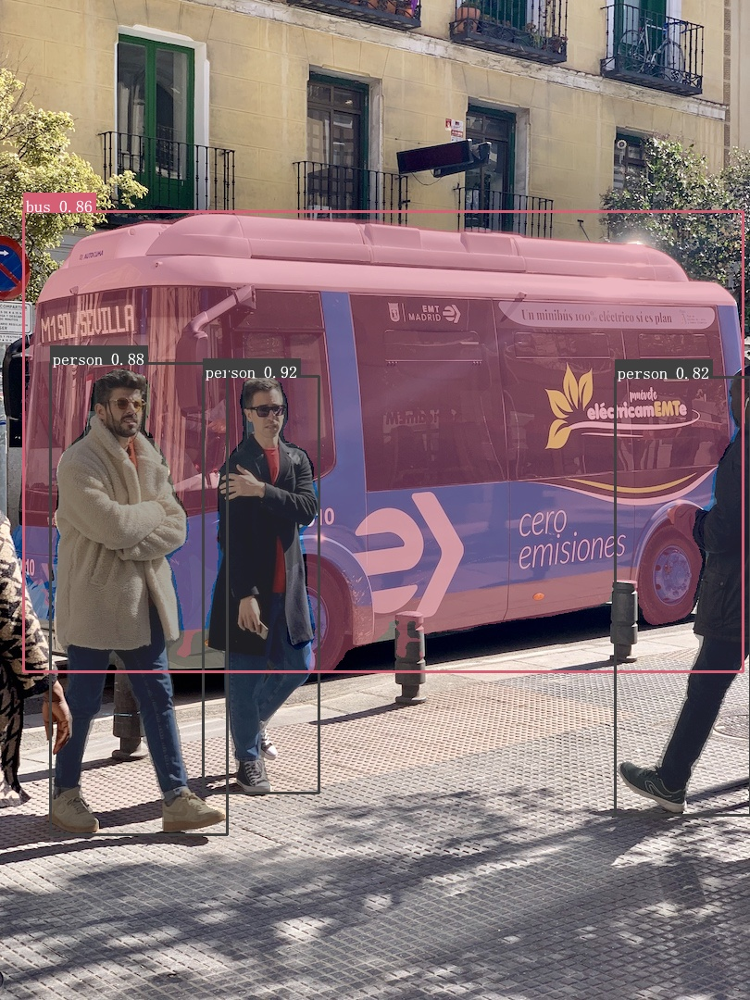 | 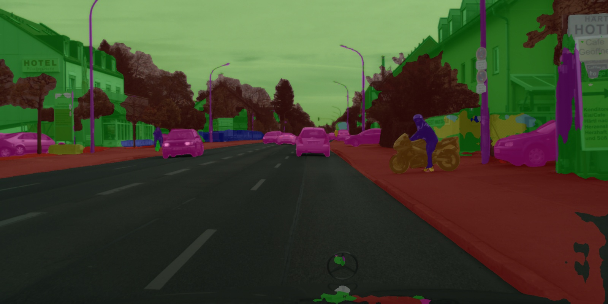 | 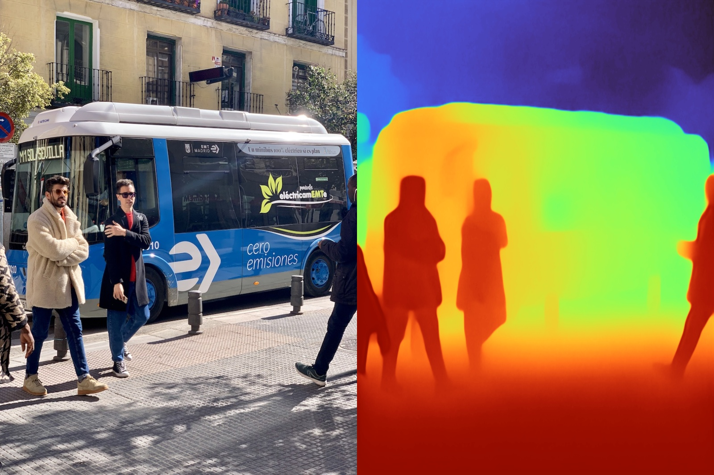 |
| **双目深度（LAS2）** | **OCR（PP-OCRv5）** | **硬件 JPEG 解码（JPU）** |
| 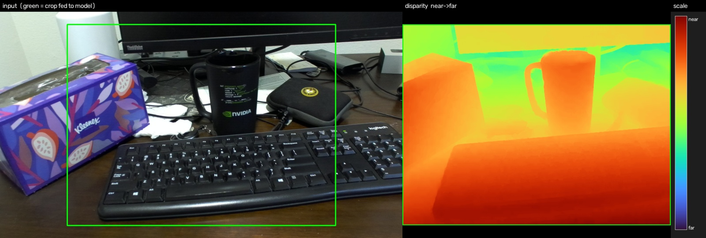 | 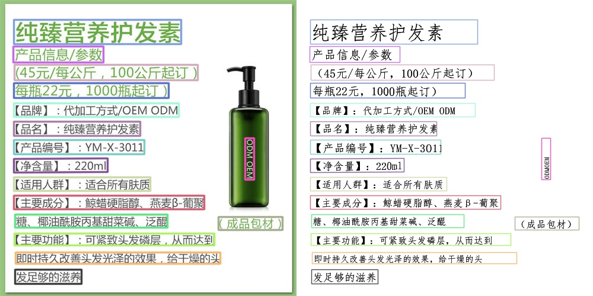 | 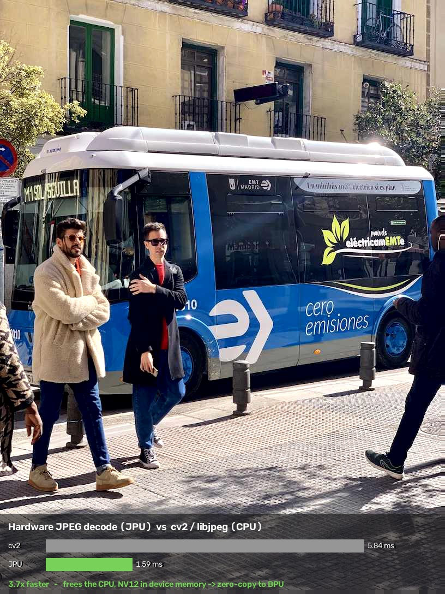 |
| **全身姿态（133 关键点）** | **稀疏特征点与匹配（XFeat）** | **超分 x4（SPAN）** |
| 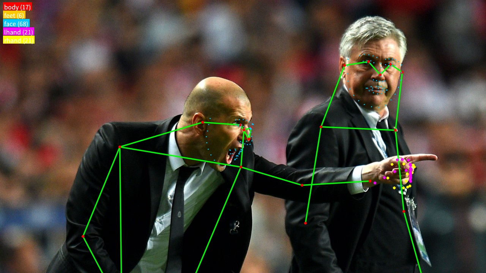 | 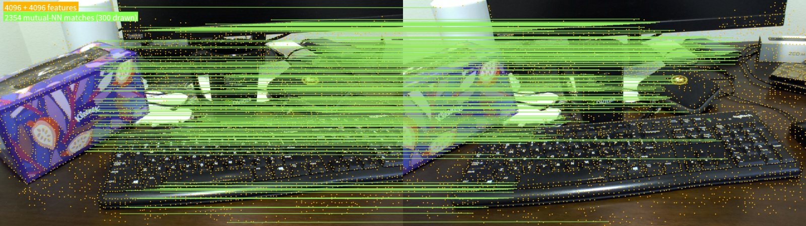 | 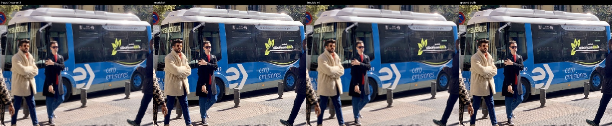 |

## 为什么选 BCDL

整个 S 系列的计算 + 多媒体栈统一在两个 hobot 原语之上：

- **`hbUCPSysMem`** —— 唯一的共享内存缓冲（`phyAddr` + `virAddr`），被 BPU 张量、
  JPU/VPU 编解码图像以及 VP 预处理单元共用。
- **`hbUCPTaskHandle_t`** —— 唯一的任务/队列模型；BPU 推理、JPEG/H.264/H.265
  编解码、resize/cvtColor 全部通过同一个 `hbUCP` 调度器提交与等待。

所以 **JPU → VP → BPU → VPU 的零拷贝是默认行为，而非额外优化。**
BCDL 是这套底层结构之上一层薄而 RAII 干净的 C++ 封装，外加可移植的后处理
（把 CUDA kernel 重写为 CPU/NEON）。

## 特性

- **后端** —— `Engine` 封装 `hbDNN`（`hbDNNInferV2`）；自动处理缓存一致性
  （推理前 clean、读取前 invalidate）；零拷贝 / 反量化的输出读取器。
- **任务**（CPU/NEON 后处理，也提供无需 Engine 的纯 `decode_*` 函数）：
  - **检测** —— anchor-free LTRB 多尺度 + DFL 头（YOLO26 / YOLOv8 /
    v5 / v11），分类别 NMS。
  - **分类、姿态**（17 关键点）、**实例分割**（proto × mask-coef）、
    **旋转框**（OBB，旋转 IoU NMS）、**语义分割**、**单目深度**、
    **双目深度**（双图视差）、**单目 3D 检测**（SMOKE —— 单张图出 3D 框 + 朝向）。
  - **OCR** —— 完整三段式 **PP-OCRv5** 流水线：DBNet 检测 → PP-LCNet
    方向分类（0°/180°）→ CRNN/CTC 识别（18385 类字典）。
  - **开放词汇检测 / 分割** —— **YOLOE**（prompt-free，自带 COCO-80 标签表
    `LabelMap`，复用 LTRB / DFL 解码，无需重训即可命名类别）。
  - **可提示分割** —— **EdgeSAM** 交互式分割（点 / 框提示；RepViT 图像编码器 →
    缓存 embedding → 提示解码器两段式，`SamSession`）。
  - **全景驾驶感知** —— YOLOP 一次推理出三个头：车辆检测（anchor-based
    `AnchorDetector`）+ 可行驶区域 + 车道线（各复用 `Segmenter`）。注意官方
    ONNX 把 anchor 解码烘进图里（ScatterND），**该解码在 BPU 上编译不出来**
    （objectness/类别列不被写入，任何阈值下都是零检测），所以图要切在解码前、
    解码走 CPU（`decodeYoloV5Anchor`）。
  - **图像嵌入** —— `ImageEmbedder` + `EmbeddingBank`（以图搜图 / 零样本分类：
    池化向量读出 + L2 归一化 + 余弦 top-k）。注意嵌入模型的 `.hbm` 常打包多个
    submodel（整图池化向量 / 逐 patch 特征图），用 `Engine::modelNames` 挑出
    池化那个；预处理是**挤压式 resize 而非 letterbox**（这类模型没见过 padding）。
  - **人脸** —— SCRFD 检测（5 关键点，对浮点关键点误差 0.35 px）+ 闭式 Umeyama
    对齐 `alignFace` 到 112×112 模板；识别不需要新任务，对齐后的 crop 走
    `ImageEmbedder`、比对走 `EmbeddingBank`。注意这个检测器**把图放左上角、
    右下补边**（`face_letterbox` 返回零 padding），用居中 letterbox 会让每个框
    和关键点整体偏移。
  - **全身姿态（133 关键点）** —— ViTPose，**自顶向下**：与上面的姿态头不同，
    它对**每个人**的裁剪跑一次，所以前面要接一个检测器、开销随人数增长；换来的
    是脚、68 点人脸和双手。1.68 ms/人。
  - **稀疏特征点与匹配** —— XFeat：可重复的关键点 + L2 归一化的 64 维描述子，
    加互为最近邻匹配（`matchFeatures`）。只有卷积主干在 BPU 上（约 1.0 ms、
    3.1 MB）；输入的 InstanceNorm 与 softmax / NMS / top-k / 稀疏采样都在 CPU，
    图里因此没有任何动态控制流。
  - **超分** —— 分块 x4 放大（`SuperResolver`，重叠交叉淡化拼接）。**两个模型
    各有所长**：SPAN 保真型，干净输入更准、体积小 6 倍；Compact 感知型、训练在
    真实退化上，模糊/压缩输入更强。按输入域选，不是谁替代谁。
  - **多目标跟踪** —— ByteTrack（Kalman + 两阶段关联）；ReID 外观嵌入的 L2
    归一化 + 余弦相似度（BoT-SORT 关联原语）。
  - 检测头同时支持 **PTQ（NV12 两平面）与 QAT 导出的浮点输入** 模型
    （`detect_float` / `letterbox_chw_float`）。
- **硬件预处理** —— VPS GDC 引擎上的固定几何变换：硬件 letterbox 与任意密集
  重映射 `GdcRemap`（cv2.remap 语义，用于双目立体校正；2448×2048 约 6.3ms，
  CPU 基本空闲）。
- **多媒体** —— 硬件 **JPEG**（JPU）与 **H.264 / H.265**（VPU）编解码。
- **流水线** —— 同步、缓冲复用的 `DetectionPipeline`，多线程
  `AsyncDetectionPipeline`（预处理 ‖ 推理 重叠）、`TrackingPipeline`、
  `StereoPipeline`，以及视频文件 → 解码 → 检测的链路。
- **Python** —— nanobind 绑定：NumPy 进/出，覆盖每个解码器 + 流水线，阻塞推理
  期间释放 GIL。

## 架构

```
python/    nanobind 绑定（NumPy <-> 张量），推理时释放 GIL
tasks/     det · cls · pose · seg · obb · semseg · depth · mono3d · ocr · open-vocab · sam · embed
           drive · face · wholebody · features · superres
tracks/    ByteTrack 多目标跟踪 · ReID 外观嵌入
pipeline/  同步 / 异步检测 · 跟踪 · 双目  (JPU -> VP -> BPU -> CPU/VPU)
media/     JpegCodec (JPU) · VideoCodec H.264/H.265 (VPU)
backend/   Engine、输出读取器             (libdnn  -> hbDNN*)
preproc/   CPU letterbox + BGR->NV12（OpenCV/OpenMP）；GDC 硬件 letterbox + 密集重映射 (VPS)；VP (hb_vp)
core/      SysMem · Task · Status · MemPool (libhbucp -> hbUCP*)
```

## 运行环境要求

- 一块 **RDK S100 / S100P / S600** 开发板（Ubuntu 22.04，aarch64），且板上已有
  D-Robotics hobot SDK（`/usr/include/hobot`、`/usr/hobot/lib`：`libdnn`、
  `libhbucp`、`libhbvp`）—— 或安装下文的 `hobot-dnn` / `hobot-media` conda 包。
  BCDL 的源码在整个 S 系列上一致；而编译出的 `.hbm` 是 **march 相关的**，
  所以请运行为你目标板编译的模型（见[模型](#模型)）。
- CMake ≥ 3.22、GCC 11、Ninja。
- OpenCV 5（图像操作；由 `BCDL_HAVE_OPENCV` 守卫，并有手写回退实现）。
- Python 模块所需：带 **nanobind** 的 Python 环境（以及 NumPy、OpenCV）。

## 安装

预编译的 **linux-aarch64** 包（Python 3.9–3.14）已发布到一个 conda 频道，
所以在板上你可以完全跳过源码构建：

```bash
conda install -c https://mirrors.ruis.ai/conda -c conda-forge bcdl
python -c "import bcdl; print(bcdl.__version__)"
```

想要一个干净、可复现的环境？新建一个并锁定版本：

```bash
conda create -n bcdl -c https://mirrors.ruis.ai/conda -c conda-forge \
    python=3.12 bcdl
conda activate bcdl
# 或锁定精确构建：   conda install ... "bcdl=0.1.0"
```

为了避免每次都带 `-c`，可以把该频道加进环境（它必须排在
conda-forge **上面**，这样 `hobot-*` 包才会从这里解析）：

```bash
conda config --env --add channels https://mirrors.ruis.ai/conda
conda config --env --add channels conda-forge
```

之后 `conda install bcdl` / `conda update bcdl` 就会直接从该频道解析。
端到端验证安装（打印版本号以及加载到的原生扩展路径）：

```bash
python -c "import bcdl, bcdl_py; print('bcdl', bcdl.__version__); print(bcdl_py.__file__)"
```

这会把整个栈解析为四个包 —— Python 绑定、C++ 库，以及它们链接的、打包好的
D-Robotics hobot SDK：

| 包 | 内容 |
|---------|-------|
| **bcdl** | `bcdl` / `bcdl_py` Python 绑定（每个 Python 3.9–3.14 各一份构建） |
| **libbcdl** | C++ 库 —— `libbcdl.so`、公共头文件，以及 `find_package(bcdl)` 的 CMake 配置 |
| **hobot-dnn** | BPU/DNN 运行时 SDK（`libdnn`、`libhbucp`、`libhbvp`…）+ `hobot/` 头文件 |
| **hobot-media** | 多媒体/编解码线（`libffmedia`、`libgdcbin`、`libmultimedia`…）+ 多媒体开发头文件 |

如果只是 **纯 C++** 的使用方，只装库即可，并用 `find_package(bcdl)` 来构建
（它会一并拉入 `libbcdl` + `hobot-dnn` + `hobot-media`）：

```bash
conda install -c https://mirrors.ruis.ai/conda -c conda-forge libbcdl
```

> 打包的 hobot SDK 仍依赖板上的 **设备平台库**
> （`libbpu`、`libhbmem`、`libalog`、`libvdsp`、`libhbipcfhal`），位于
> `/usr/hobot/lib` —— 它们随 RDK 系统镜像一起提供，通过 `ldconfig` 解析，
> 出于设计目的不随包重新分发。

## 快速上手

**Python** —— 预处理 ‖ 推理 重叠的流式检测：

```python
import bcdl

engine = bcdl.Engine("models/yolo26s_det_nashm_640x640_nv12.hbm")
cfg = bcdl.PipelineConfig(); cfg.detect.num_classes = 80
pipe = bcdl.AsyncDetectionPipeline(engine, cfg, depth=3)

for i, frame in enumerate(frames):          # frame: HxWx3 uint8 BGR
    pipe.submit(frame)                       # 队满则阻塞（背压）
    if i >= 3:
        for d in pipe.next():                # 按提交顺序返回结果
            print(d.class_id, d.score, d.x1, d.y1, d.x2, d.y2)
pipe.finish()
while (dets := pipe.next()) is not None:
    ...                                      # 排空最后在途的帧
```

纯函数解码器也对外暴露，用于纯 NumPy 路径
（`bcdl.decode`、`bcdl.decode_pose`、`bcdl.decode_obb`、`bcdl.decode_ctc`…）。

**C++** —— [`examples/`](examples/) 目录有可独立运行的程序：

```bash
./build/det_demo    models/yolo26s_det_nashm_640x640_nv12.hbm data/images/bus.jpg
./build/ocr_demo    data/images/ocr.jpg          # PP-OCRv5 det -> cls -> rec
./build/track_demo  models/yolo26s_det_nashm_640x640_nv12.hbm  # 检测 + ByteTrack
./build/video_det_demo  stream.h264 model.hbm    # VPU 解码 -> BPU 检测
```

完整的接口面 —— 每个类、配置和解码器，并附每个任务的用法片段 —— 见下文
[API 参考](#文档)。

## 从源码构建

在板上、在你的 Python/conda 环境里构建（需要 hobot SDK —— 来自上文的
`hobot-dnn` / `hobot-media` conda 包，或系统镜像里的 `/usr/include/hobot` +
`/usr/hobot/lib`）：

```bash
cmake -S . -B build -G Ninja -DCMAKE_BUILD_TYPE=Release
cmake --build build -j
```

这会构建 `bcdl` 库、C++ 示例，以及 `bcdl_py` Python 模块。

**从 CMake 安装并使用** —— 支持 `find_package(bcdl)`：

```bash
cmake --install build --prefix /your/prefix
```
```cmake
find_package(bcdl CONFIG REQUIRED)
target_link_libraries(your_target PRIVATE bcdl::bcdl)   # 一并带入头文件 + hobot 依赖
```

**安装 Python 模块** —— 一个可 pip 安装的 wheel（scikit-build-core）；
请在板上构建（C++ 构建需要 hobot SDK）：

```bash
pip install .          # 或： pip wheel . -w dist/
python -c "import bcdl; print(bcdl.__version__)"
```

### 模型

编译好的 BPU 模型（`.hbm`）**不**纳入版本库（体积大）—— 请放到
[`models/`](models/) 下，用 [`scripts/fetch_models.sh`](scripts/fetch_models.sh)
填充。模型转换（ONNX → `.hbm`、PTQ 校准）是在 x86 主机上用 D-Robotics
**OpenExplorer** 工具链 **离线** 完成的；完整的转换配方（导出、校准、`hb_compile`
配置与各模型的精度/延迟实测）在配套仓库
[**bcdl-model-zoo**](https://github.com/ruisv/bcdl-model-zoo)。每个 `.hbm` 都为
特定 BPU **march** 编译，所以请用为你的板子编译的那一份（S100 / S100P 共用 Nash
march；S600 为其自身编译）—— BCDL 运行时本身在整个 S 系列上一致。

**每个模型是什么、从哪来、该取哪个 build、以及各自的许可证，见
[`docs/MODELS.md`](docs/MODELS.md)。** 示例/基准用到的模型都是第三方的，**权重及其
编译产物遵循各自的原始许可证** —— 其中 Ultralytics YOLO 权重为 **AGPL-3.0**（著佐权，
商用需其 Enterprise 授权），insightface 的人脸预训练权重为**学术非商用**；重新分发或
商用前请逐一核对。BCDL 自身的代码（本仓库，Apache-2.0）与这些无关 —— 它是一个能加载
任意 `.hbm` 的通用运行时,上述许可证约束的是模型权重,而非 BCDL。

## 文档

| 文档 | 涵盖内容 |
|----------|----------------|
| [`docs/API.md`](docs/API.md) | **Python API 参考** —— 每个类、配置和 `decode_*` 函数，附每个任务的用法片段。 |
| [`docs/CPP_API.md`](docs/CPP_API.md) | **C++ API 参考** —— `namespace bcdl` 下的同一接口面，对应到各头文件。 |
| [`docs/MODELS.md`](docs/MODELS.md) | **模型清单** —— 示例与基准用到的每个 `.hbm`：来源、该取哪个 build、许可证。 |
| [`benchmarks/RESULTS.md`](benchmarks/RESULTS.md) | 完整板端基准数据 + [效果展示](#效果展示)中的标注校验图。 |
| [`CONTRIBUTING.md`](CONTRIBUTING.md) | 如何搭建、构建（在板上）、测试并提交改动。 |
| [`CHANGELOG.md`](CHANGELOG.md) | 发布说明（Keep a Changelog / SemVer）。 |

公共头文件在 [`include/bcdl/`](include/bcdl/)；可运行程序在
[`examples/`](examples/)。

## 性能基准

在 **RDK S100P**（sw 4.0.5）上测得。`infer` 仅为 BPU 推理；`decode`
加上 BCDL 的后处理；`model` 为 `.hbm` 在磁盘上的大小。每一行的标注输出见
[效果展示](#效果展示)。

| 任务 | 模型 | 输入 | infer ms | infer FPS | decode ms | model MB |
|------|-------|-------|----------|-----------|-----------|----------|
| cls    | yolo26n              | 224²        | 0.44  | 2251 | 0.49  | 3.9  |
| det    | yolo26n (LTRB)       | 640²        | 1.16  | 860  | 2.02  | 7.8  |
| det_dfl| yolov8 (DFL 头)      | 640²        | 1.45  | 689  | 9.49  | 3.7  |
| pose   | yolo26n              | 640²        | 1.29  | 778  | 1.46  | 7.7  |
| seg    | yolo26n              | 640²        | 1.63  | 615  | 10.7  | 9.9  |
| obb    | yolo26n              | 640²        | 1.11  | 900  | 1.65  | 5.8  |
| semseg | deeplabv3plus        | 2048×1024   | 49.0  | 20   | 57.2  | 39.1 |
| semseg_rt| PIDNet-S (1/8 出图) | 2048×1024   | 4.52  | 221  | 4.70  | 19.0 |
| depth  | depth-anything-v2    | 686×518     | 111   | 9    | 115   | 121.8|
| stereo | las2-m (crop)        | 640×480     | 14.0  | 72   | 21.6  | 40.7 |
| ocr    | PP-OCRv5 (det→cls→rec)| 960² / 48×320 | 20.0 | 50  | 135   | 35.3 |
| embed  | SigLIP base/16       | 224²        | 19.3  | 52   | 20.2  | 129  |
| drive  | YOLOP (det+可行驶+车道)| 640²       | 2.80  | 358  | 5.44  | 12.0 |
| face⁰  | SCRFD-10G            | 640²        | 60.2  | 17   | 61.5  | 5.9  |
| wholebody| ViTPose-S (133 点)  | 192×256     | 1.69  | 593  | 17.3¹ | 29.1 |
| features| XFeat              | 640×480     | 1.00  | 998  | 201²  | 3.2  |
| superres| Compact x4         | 128²        | 2.04  | 491  | 27.6³ | 38.9 |
| superres| SPAN ch48 x4       | 128²        | 1.14  | 874  | 22.5³ | 6.1  |

⁰ 人脸不在 `board_bench.py` 套件里（需人脸图），这一行是单独测的；其余各行来自同一次干净运行。
  SCRFD-10G 是重型档，要提速换 2.5g。识别侧接 `ImageEmbedder`（对浮点余弦 0.975）。
¹ 自顶向下：`infer` 是**单人**，`decode` 是整帧（该图 2 人）——开销随人数增长。
² 含两张图各自的提取**与匹配**；匹配是 O(|a|·|b|·64)，默认 4096 点/边就占其中约 130 ms，
   把 `top_k` 降到 1024 只要 8 ms。
³ 分块放大：`infer` 是**单块**，`decode` 是整图（202×270 → 808×1080，6 块）。

yolo26s @1280×720 的流式吞吐：同步 **216 FPS**，异步重叠 **334 FPS**（1.55×）。
硬件 **JPEG** 解码（JPU）在样例图上比 `cv2`/libjpeg 快 **≈3.6–5.3×**，并卸载
CPU（零拷贝 NV12→BPU）。

压缩视频端到端（`AsyncVideoDetectionPipeline`，yolo26n @1080p）：**H.264 441 FPS**、
**H.265 439–451 FPS**，瓶颈落在 VPU 解码。解码出的 NV12 由 GDC 硬件 letterbox 直接落到
模型输入，无 BGR 往返（0.97 ms/帧，其中仅 ~0.3 ms 占 CPU）。纯 VPU 解码 452 / 481 FPS。
输入必须是 **Annex-B 裸流**——mp4 请先用 `ffmpeg -c:v copy -bsf:v h264_mp4toannexb`
解封装（只拆容器，不碰像素）。

在板上复现：

```bash
PYTHONPATH=build:python python scripts/board_bench.py --retry-until-clean 3
```

> `--retry-until-clean` 会拿 `det` / `depth` 两行与已提交的 `results.json` 对表，偏离过大就判为
> **板子被别的进程占用**、丢弃重跑。这不是保险起见——同一个模型实测过 **30 倍**的差异。
> 别的判据都靠不住：load average 被常驻 D 状态的内核线程顶在核数附近；进程检查会正好落在
> 别人任务的两批之间；连 `hrt_model_exec` 也一样会被拖慢（同一模型脏板 22ms / 干净 0.95ms）。
> **结果本身是唯一可靠的信号。**

## 测试

在 **已安装 bcdl** 的情况下（用上文的 conda 频道，或一个 pip wheel），直接对
已安装模块跑测试套件 —— 无需设置 `PYTHONPATH`：

```bash
pip install pytest          # 同时需检出本仓库以获取测试文件
pytest tests/               # 完整套件；缺模型的板端测试会跳过
```

如果是 **源码构建**，则让 pytest 指向源码树内的模块：

```bash
# (1) 无需 Engine 的 numpy 解码测试 —— 不需要板子 / 不需要模型：
PYTHONPATH=build:python pytest tests/test_detection.py tests/test_pose.py \
    tests/test_obb.py tests/test_instance_seg.py tests/test_depth_seg.py \
    tests/test_depth_seg_py.py tests/test_classification.py tests/test_ocr.py

# (2) 板端、真实模型端到端 —— 需要填充好 models/；每个任务在其模型/图像缺失时
#     都会干净地跳过：
PYTHONPATH=build:python pytest tests/
```

两层：后处理数学由 **确定性 NumPy 测试** 通过无需 Engine 的 `decode_*` 绑定
钉死（任何地方都能跑），随后 **板端套件** 在真实模型上验证完整的 BPU/编解码路径。
在 RDK S100P 上，对 **conda 包**（`bcdl` + `libbcdl` + `hobot-dnn` +
`hobot-media`）端到端：**96 通过、1 跳过**（共收集 97 个；该跳过项需要显式
`--hbm`）。

| 分组 | 文件 | 测试数 | 需要板子？ |
|-------|-------|-------|--------------|
| 解码数学（det/cls/pose/obb/实例分割/depth/seg/ocr/stereo）+ 内存安全 | `test_detection`、`test_classification`、`test_pose`、`test_obb`、`test_instance_seg`、`test_depth_seg`(+`_py`)、`test_ocr`、`test_stereo_py`、`test_memory_safety` | 66 | 否 |
| 真实模型上的任务（cls·det·det_dfl·pose·seg·obb·semseg·depth·OCR 三段） | `test_board_models` | 11 | 是 |
| 双目深度（真实 LAS2 `.hbm`） | `test_stereo_board_py` | 3 | 是 |
| 多媒体编解码（VPImage · JPEG/JPU · H.264/H.265/VPU） | `test_codec_py`、`test_video_decode_py` | 11 | 是 |
| 流水线（ByteTrack、异步检测） | `test_tracking_py`、`test_async_detection_py` | 5 | 是 |

## 社区交流

欢迎加入 **BCDL (BPU) 技术交流群**，一起讨论 RDK / BPU 部署与本项目的使用。


> 微信群二维码有有效期，若已过期请在 [Issues](../../issues) 留言，我们会更新；
> 也欢迎直接在 [Issues](../../issues) 交流。

## 参与贡献

欢迎贡献 —— issue 与 pull request 皆可。完整指南见
[`CONTRIBUTING.md`](CONTRIBUTING.md)；要点如下：

- **在任意机器开发，在板上构建与运行。** hobot SDK 只存在于 RDK 硬件上，所以
  C++ 库和板端测试套件必须在 S100 / S100P / S600 板上构建并执行。无需 Engine 的
  NumPy `decode_*` 测试可在任意主机上运行（见[测试](#测试)）。
- **约定** —— 头文件用 `.h`，实现用 `.cc`；命名空间 `bcdl`；错误通过
  `BCDL_CHECK(...)` → `bcdl::Error`。与周围代码的风格和结构保持一致。
- **测试** —— 任何行为变更都要新增或更新测试。用一个通过 `decode_*` 绑定的
  确定性 NumPy 测试钉死后处理数学（任意地方可跑），并在涉及模型时补一个板端
  端到端测试，且其模型缺失时能干净跳过。
- **提交** —— 保持聚焦；遵循日志中已有的
  [Conventional Commits](https://www.conventionalcommits.org/) 风格。
- **Changelog** —— 在 [`CHANGELOG.md`](CHANGELOG.md) 的 `[Unreleased]` 下记录
  对用户可见的变更。

## 致谢

- **D-Robotics** —— RDK S100 / S100P / S600 平台与 hobot SDK（`hbDNN`、
  `hbUCP`、`hb_vp`、多媒体/编解码），BCDL 构建于其上，以及 `rdk_model_zoo`
  参考模型。
- **[nanobind](https://github.com/wjakob/nanobind)** —— Python 绑定层。
- **[OpenCV](https://opencv.org/)** —— 预处理路径上的图像操作。
- BCDL 重新实现了其后处理的上游模型作者 —— **PaddleOCR / PaddlePaddle**
  （PP-OCRv5、PP-LCNet）、**Ultralytics**（YOLO 系列）、**Depth-Anything-V2**
  与 **DeepLabV3+**。其许可证见[模型](#模型)；BCDL 不打包这些权重中的任何一个。

## 许可证

BCDL 以 **Apache License 2.0** 授权 —— 见 [`LICENSE`](LICENSE)。

这只覆盖 BCDL 自身的源码。`models/` 下的第三方模型权重及其编译产物受各自上游
许可证约束（见[模型](#模型)）—— 尤其 Ultralytics YOLO 权重为 AGPL-3.0，
使用或再分发前请遵循其原始授权。
